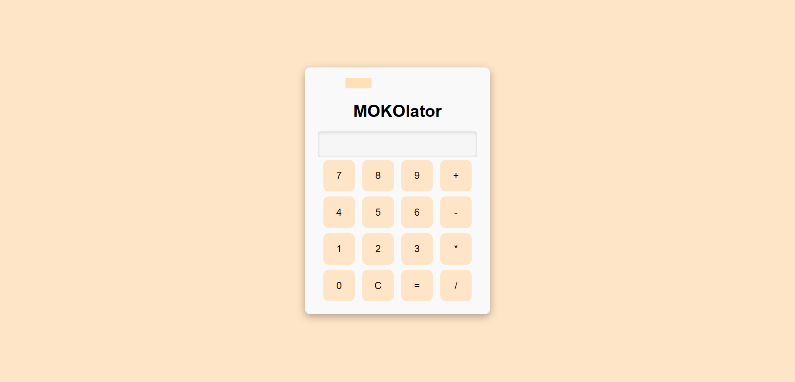

# MOKOlator - Simple Calculator with Animation

A simple calculator web application built with **HTML, CSS, and JavaScript**, enhanced with a small **canvas animation**.  

You can try it online here: [Live Demo on Vercel](https://calculator-rho-beige-31.vercel.app/)

---

## **Features**

- Basic arithmetic operations: `+`, `-`, `*`, `/`
- Clear button (`C`) to reset input
- Input validation to prevent errors
- Smooth animations using `<canvas>` element
- Simple and clean UI with interactive buttons

---

## **Project Structure**

calculator/
├── index.html # Main HTML file
├── style.css # Stylesheet for layout and design
├── index.js # Calculator functionality
├── animation.js # Simple canvas animation
## Screenshot 


## **How to Run Locally**

1. Clone the repository:
```bash
git clone https://github.com/the843/calculator.git
Navigate to the project folder:
cd calculator
Open index.html in your browser to see the calculator running.

Usage
Click the number buttons to enter values.

Click the operation buttons (+, -, *, /) to choose an operation.

Click = to calculate the result.

Click C to clear the display.

The animation runs continuously in the top canvas.

Technologies Used
HTML5

CSS3

JavaScript (Vanilla JS)

Canvas API for animation

Vercel for deployment


Live Demo
https://calculator-rho-beige-31.vercel.app/

Author
Hix (GitHub: https://github.com/the843)


